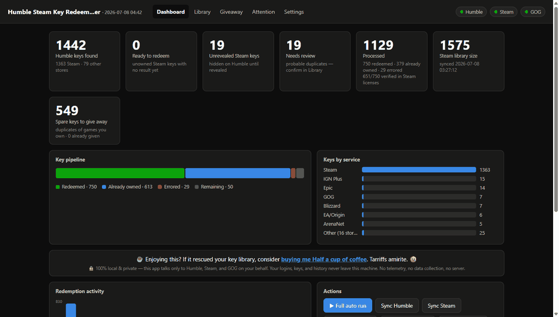
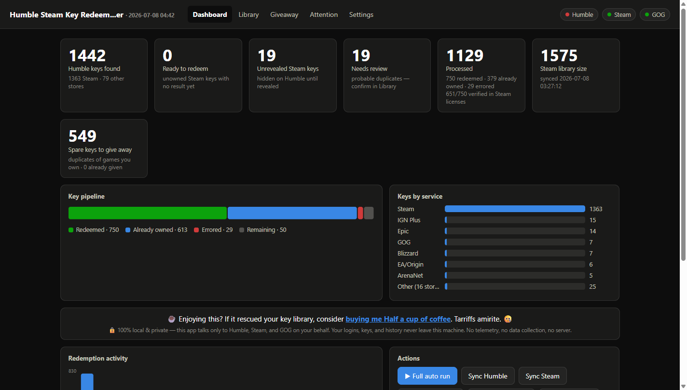
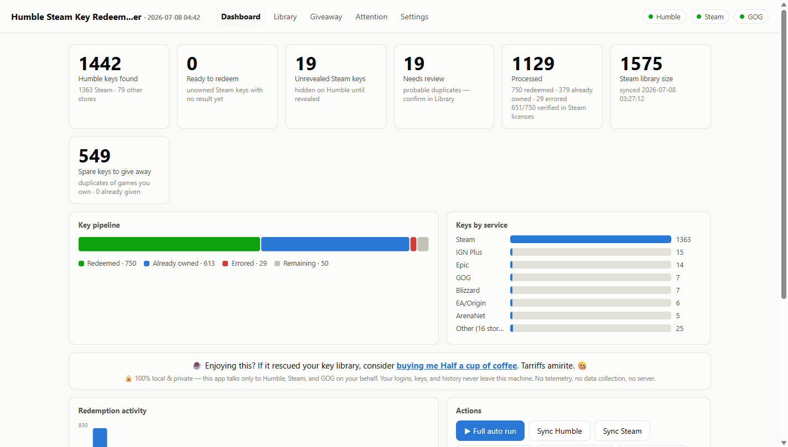
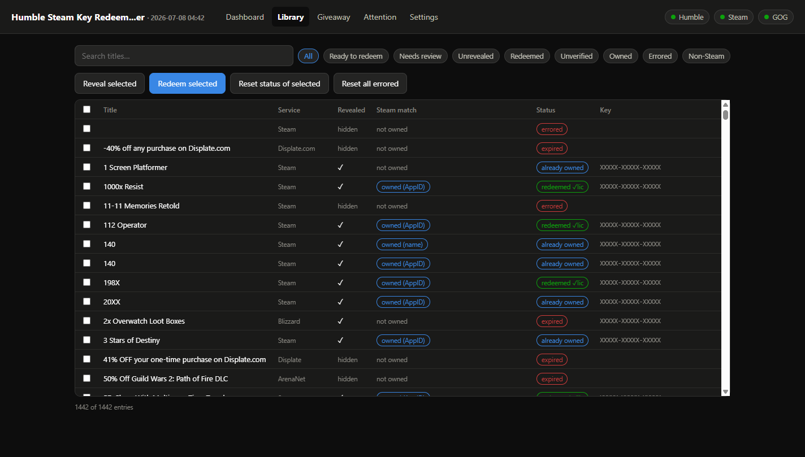
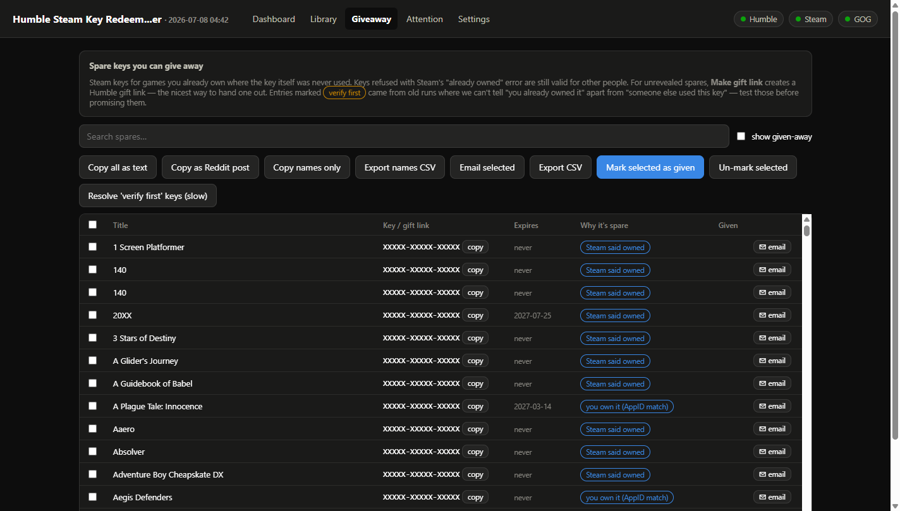
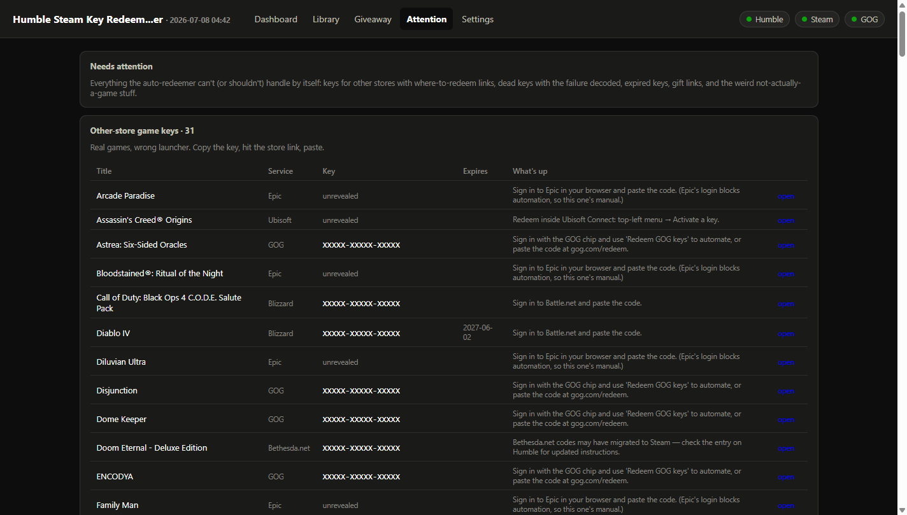

# Humble Steam Key Redeemer

**Rescue your Humble Bundle key backlog.** A free, open source web app that runs entirely on your own machine. It finds every key you've ever bought, claims your unclaimed Humble Choice games, redeems everything you don't already own on Steam, warns you before keys expire, and rounds up your duplicate keys so you can give them away.

[](../../releases/latest)
[](LICENSE)

[](https://ko-fi.com/sparklemuffin)



## Quick start

1. Download the [latest release](../../releases/latest) for your OS (Windows `.exe`, macOS zip, Linux tar.gz). No install, no Python needed. On Windows you can grab the portable `HumbleRedeemer.exe` or run `HumbleRedeemer-<version>-Setup.exe` for a proper Start Menu install with an uninstaller.
2. Run it. The dashboard opens at `http://127.0.0.1:5757` in whatever browser you use (Chrome, Firefox, Opera GX, anything).
3. Sign in to Humble and Steam from the header chips (2FA/Steam Guard supported), then hit **▶ Full auto run**.

On Windows the app lives in the **system tray** (blue key icon by the clock): closing the browser tab just "minimizes" it. The app keeps running in the background, and reopening `http://127.0.0.1:5757` (or double-clicking the tray icon) brings it right back. Quit from the tray icon's menu or the ⏻ chip in the dashboard. Prefer a plain console window instead? Untick *Run in the system tray* in Settings.

The Humble/GOG automation runs in a separate hidden browser using Chrome or Firefox; if neither is installed, Selenium usually downloads a private copy of Chrome automatically. Windows builds are signed (publisher: Charles Chambers). macOS builds are unsigned, so right-click and Open the first time.

## What it does

- **Metrics dashboard.** Key pipeline, per service breakdown, redemption activity over time.
- **Full auto mode.** Claim Choice games, sync Humble, sync Steam, match ownership, reveal and redeem every unowned key, then verify licenses, riding out Steam's rate limits with a countdown.
- **Three tier ownership matching.** Steam AppID, then normalized names (™/®/case/punctuation), then a conservative fuzzy pass whose "likely owned" hits you confirm with one click.
- **Humble Choice auto-claim.** Walks every Choice/Monthly month you've ever had and claims everything unclaimed.
- **Expiration tracking.** Keys with Humble deadlines get flagged before they die.
- **Steam license verification.** Confirms your redeemed keys actually landed on your account.
- **Giveaway page.** Finds your *duplicates* (keys for games you already own that were never consumed): click to copy, email drafts, a Reddit post generator, a names only list for DM giveaways, Humble gift link creation, and tracking for what you've given away.
- **Attention page.** Everything that can't auto-redeem: other-store keys with links for where to redeem them, dead keys with the Steam error decoded, expired keys, and the weird non-game stuff.
- **GOG support.** Library sync, ownership skip, and browser-driven redemption.
- **Library browser.** Search and filter all your keys by state, with bulk reveal/redeem/reset.
- **Runs in the system tray** (Windows). Close the tab and it keeps working; update banners tell you when a newer version is on GitHub.

<details>
<summary><b>More screenshots</b></summary>

**Dashboard (dark)**


**Dashboard (light)**


**Library**


**Giveaway page**


**Attention page**


</details>

## Updates

The app checks this GitHub repo once at launch (a read-only fetch of public repo info, nothing about you is sent) and shows a banner when newer code has been pushed. You can silence it per-update ("remind me when the *next* one lands") or forever, from the banner or Settings → Updates.

**Emergency releases** override silencing: if [`update_notice.json`](update_notice.json) in this repo has `emergency: true`, every running app that's behind shows a red banner with that notice's title/message explaining why the update can't wait (security fixes, breakage that could waste keys). It disappears as soon as you're up to date. Set `APP_NO_UPDATE_CHECK=1` to disable all update checking.

## Privacy

**Everything runs locally.** No server, no accounts, no telemetry, no data collection. Your logins are stored as session cookies in local files (`.humblecookies`, `.steamcookies`, `.gogcookies`), and your keys/history live in a local SQLite database (`redeemer.db`) next to the app. The only network connections it ever makes are to Humble Bundle, Steam, and GOG, acting as you, on your machine, for you, plus a read-only GitHub version check at launch (disable with `APP_NO_UPDATE_CHECK=1`). Delete the cookie files to sign out; delete `redeemer.db` to wipe all history.

## Disclaimer

This is an **unofficial** tool, not affiliated with or endorsed by Humble Bundle, Valve/Steam, or GOG. It automates actions on your own accounts (fetching your library, revealing and activating your keys); automated account access may conflict with those services' terms of service. Use at your own risk. The software is provided **as is**, with no warranty of any kind, and you are solely responsible for your accounts and keys. Originally inspired by [FailSpy's humble-steam-key-redeemer](https://github.com/FailSpy/humble-steam-key-redeemer), since fully rewritten.

## Running from source

Packaged builds need nothing installed. From source, you need Python 3.10+:

```
pip install -r requirements.txt
python app.py
```

On Windows, `run_app.bat` launches it windowless in the system tray (output goes to `app.log`); `run_app_debug.bat` keeps a console window with live logs. Optional: `pip install python-Levenshtein` makes the fuzzy matching faster.

## Support

If this tool rescued your key library, consider [buying me half a cup of coffee](https://ko-fi.com/sparklemuffin). Tarriffs amirite.
